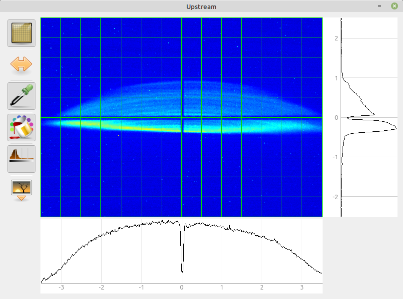
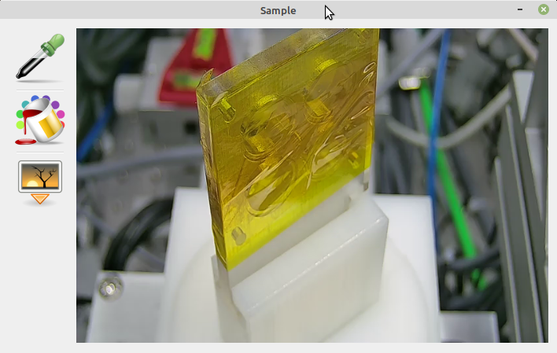
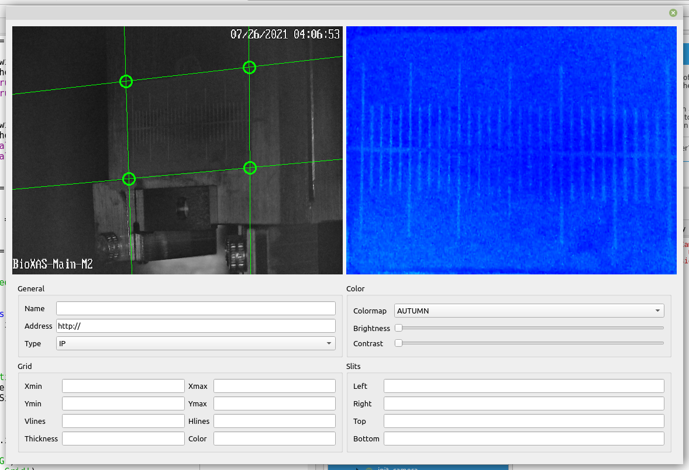

# QtCamWidget
Qt widget to interact with GigE/IP cameras





Dependencies:
* pyqtgraph
* opencv
* Aravis (GigE library)
* pyepics (to control movement and show slits)


Installation
1. We use Aravis (https://github.com/AravisProject/aravis) to get the stream from the GigE cameras. To build it in Ubuntu start with installing system wide packages:

```Bash
sudo apt install build-essential meson cmake libgstreamer1.0-dev autoconf intltool \
python-gobject-2-dev gobject-introspection gtk-doc-tools libxml2-dev libgirepository1.0-dev \
libglib2.0-dev libgtk-3-dev libnotify-dev libgstreamer-plugins-base1.0-dev gstreamer1.0-plugins-bad \
libusb-1.0-0-dev
```

Next we download the latest stable version from http://ftp.acc.umu.se/pub/GNOME/sources/aravis/ and extract it. 
Follow the instructions at the github page to build it with meson, but make sure to change the installation directory by running
"meson configure -Dprefix=/usr/lib" BEFORE you build the package with "meson build", otherwise the files will be installed to /usr/local/lib/x86_64-linux-gnu and you'll have to copy them manually.
Check the installation running the arv-viewer-0.x (arv-viewer-0.8 at the time I'm writing this), a widget with fake camera in the list should show up.

2. I recommend to use anaconda and set up a dedicated environment to make averything work, at least for the prototyping phase. Anaconda installation is pretty straightforward.
Then create a new environment (skip this if you use existing one)
```Bash
conda create -n bpmview python=3.7
conda activate bpmview
```

Next install dependencies: (make sure to use correct versions, latest available didn't work for me)

```Bash
pip install pycairo==1.18
pip install opencv-python==4.1.2.30
pip install pygobject pyqtgraph pyepics pyqt5
```
We are almost there. 

3. Running the script
Download the script from this repository, carefully inspect the code and modify all PV names and addresses. I use perspective correction on the BPMs to show real beam image, these parameters will be different in every case. 
Activate anaconda environment:
```Bash
conda activate bpmview
```

Run the script. 
```Bash
python qt_axiscam.py
```
If import complains on gi.repository or Aravis go to /usr/lib and copy the "girepository-1.0" folder to ~/anaconda3/envs/bpmview/lib

Now you can open the settings and change camera name/adress/paths and set warping by dragging the circles to form the corner points of the image.




